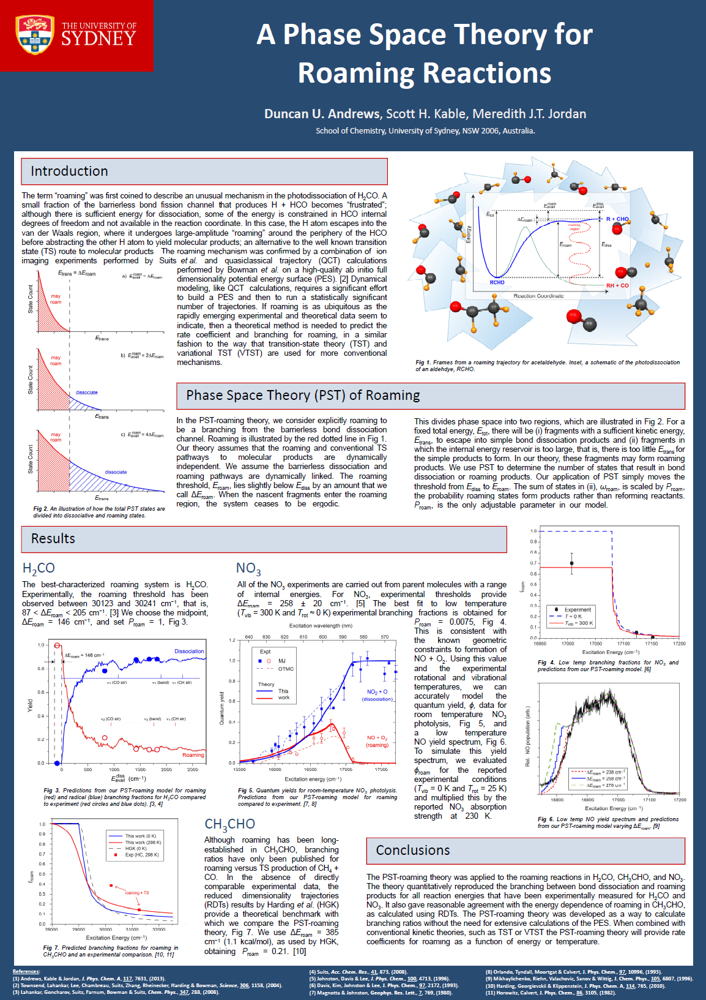
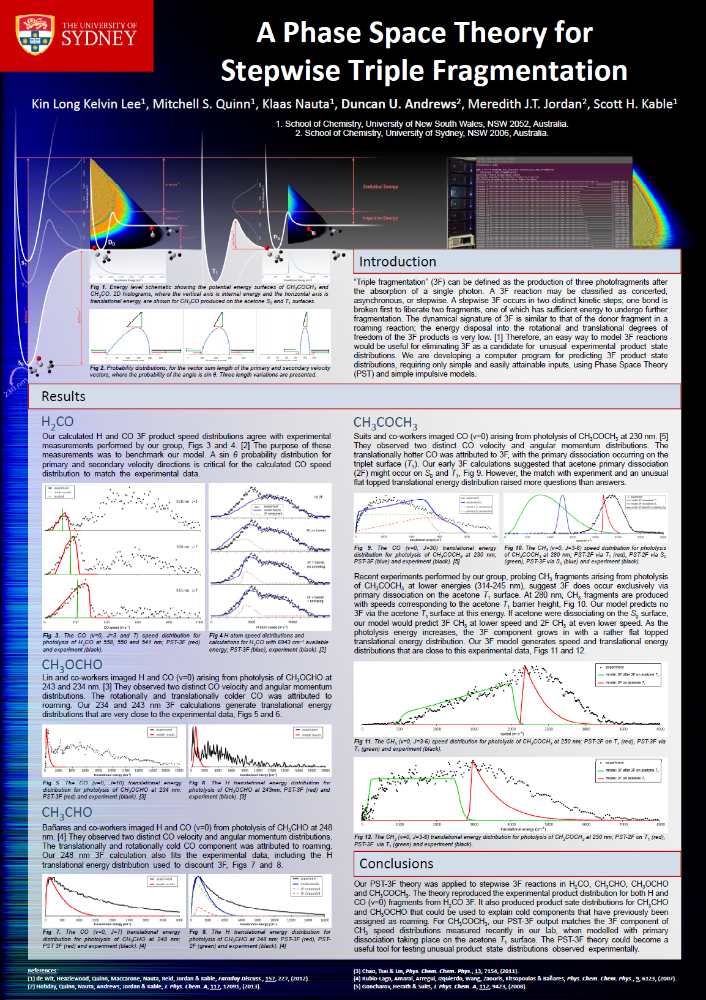

# PST.tools

A C++/MPI program for counting quantum states.

[Cluster Installation Instructions](Docs/Cluster_Installation_Instructions.pdf)

[Description of Code](Docs/PSTtools_descOfCode_v01.pdf)

[Thesis Describing Version 1 - Roaming](Docs/thesis.pdf)

[Roaming Model Paper](https://pubs.acs.org/doi/10.1021/jp405582z)

[Triple Fragmentation Model Paper](https://pubs.acs.org/doi/10.1021/jp404895y)

